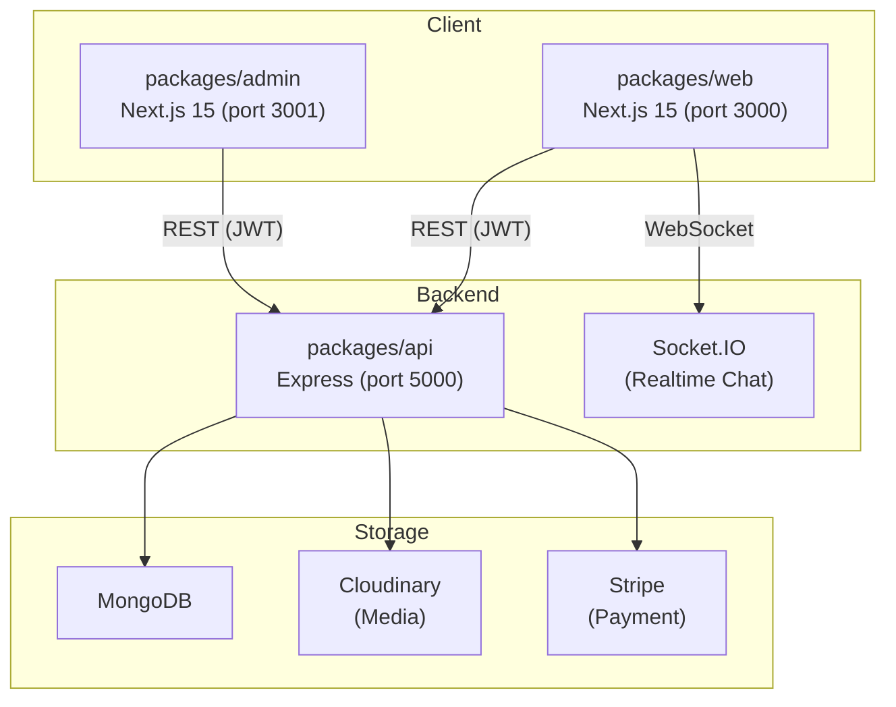

# Báo Cáo Kỹ Thuật — Dự Án Carzy (Used Car Marketplace)

> **Ngày lập báo cáo:** 16/03/2026  
> **Phiên bản dự án:** 1.0.0  
> **Người phân tích:** Antigravity AI

---

## 1. Tổng Quan Dự Án

**Carzy** là một ứng dụng chợ xe cũ (ô tô, xe máy, xe đạp) được xây dựng theo kiến trúc **Monorepo** (npm workspaces), gồm 3 package chính hoạt động độc lập:

| Package | Công nghệ | Port | Mô tả |
|---|---|---|---|
| `packages/api` | Node.js, Express, MongoDB, Socket.IO | 5000 | REST API Backend |
| `packages/web` | Next.js 15, React 19, TypeScript, Tailwind CSS | 3000 | Frontend người dùng |
| `packages/admin` | Next.js 15, React 19, TypeScript, Tailwind CSS | 3001 | Dashboard quản trị |
| `packages/public` | — | — | Tài nguyên dùng chung (chưa khai thác) |

---

## 2. Kiến Trúc Hiện Tại

### 2.1 Backend (`packages/api`)

Backend sử dụng kiến trúc **MVC (Model - View - Controller)** với cấu trúc thư mục:

```
src/
├── config/         # Cấu hình DB, Cloudinary
├── controllers/    # Xử lý HTTP request/response
├── middleware/     # auth.js, verifiedKyc.js
├── models/         # Mongoose schemas
├── routes/         # Express routers
├── services/       # Business logic layer (một phần)
├── utils/          # Tiện ích (notificationUtil,...)
└── seed/           # Dữ liệu khởi tạo
```

**Luồng xử lý request:**
```
Client → Router → Middleware (protect/admin) → Controller → [Service?] → Model → MongoDB
```

> [!NOTE]
> Dấu `?` ở `[Service?]` là có chủ ý — luồng không nhất quán: có controller gọi service, có controller bypass thẳng vào model.

### 2.2 Frontend (`packages/web` & `packages/admin`)

Cả hai frontend đều sử dụng **Next.js 15 App Router** với TypeScript. Cấu trúc thư mục `web`:

```
src/
├── app/            # Next.js App Router (pages)
├── components/     # Shared components
├── contexts/       # AuthContext, NotificationContext
├── hooks/          # Custom hooks
├── config/         # API endpoints config
├── types/          # TypeScript type definitions
└── utils/          # Utility functions
```

### 2.3 Diagram Kiến Trúc Tổng Thể



---

## 3. Phân Tích Chi Tiết Từng Layer

### 3.1 Data Layer — Models

**Điểm mạnh:**
- Schema rõ ràng, có validation với Mongoose enum
- `User.js` có pre-save hook hash mật khẩu bcrypt tự động
- `Vehicle.js` có conditional required fields theo type (car/motorcycle/bicycle)

**Vấn đề:**
- `User.js` không dùng `{ timestamps: true }` của Mongoose mà tự khai báo `created_at`, `updated_at` thủ công — dư thừa
- Field đặt tên `password_hash` nhưng trong schema lại nhận plain text password rồi hash trong hook — gây nhầm lẫn
- `VehicleSchema` không có `index` cho các field thường dùng tìm kiếm (`type`, `make`, `model`, `price`, `location`)

```js
// packages/api/src/models/User.js — Vấn đề: tự quản lý timestamp thủ công
created_at: { type: Date, default: Date.now },  // ← thay bằng { timestamps: true }
updated_at: { type: Date, default: Date.now }
```

### 3.2 Service Layer

**Hiện trạng không nhất quán:**

| Service file | Có class | Được controller gọi? |
|---|---|---|
| `userService.js` | ✅ Class | ❌ Chỉ dùng `deleteUser` |
| `vehicleService.js` | ✅ Class | ❌ Không được gọi |
| `chatService.js` | — | Gọi trực tiếp |
| `paymentService.js` | — | Gọi trực tiếp |
| `statisticsService.js` | — | Gọi trực tiếp |

> [!WARNING]
> `vehicleController.js` (383 dòng) **không gọi `vehicleService.js`** — toàn bộ business logic và database queries được viết lại trực tiếp trong controller. `userController.js` (687 dòng) cũng gọi `User.findOne()`, `User.findById()` trực tiếp thay vì qua service.

### 3.3 Controller Layer

**Vấn đề lớn nhất — "Fat Controller":**

`userController.js` dài **687 dòng** chứa đồng thời:
- Logic xác thực (JWT sign/verify)
- Database queries
- Business rules (kiểm tra role, KYC status)
- Response formatting
- Authorization checks (kiểm tra `req.user.role === 'admin'` inline)

```js
// packages/api/src/controllers/userController.js L222-229 — Vi phạm SRP
// Controller đang làm việc của service:
const vehicleCount = await require('../models/Vehicle').countDocuments({ ... });
const favoriteCount = await require('../models/Favorite').countDocuments({ ... });
```

> [!CAUTION]
> **`require()` trong thân hàm** là anti-pattern nguy hiểm — gây circular dependency tiềm ẩn và khó test.

**Console.log debug còn sót lại trong production code:**
```js
// vehicleController.js
console.log('Received create vehicle request');
console.log('User ID:', req.user?._id);
console.log('Vehicle data received:', { ... });
console.log('Cloudinary config:', { ... }); // Lộ thông tin cấu hình!
```

### 3.4 Routing & Entry Point

`index.js` (119 dòng) chứa tất cả:
- Khởi tạo Express
- Socket.IO setup
- Đăng ký tất cả routes
- **Định nghĩa auth routes trực tiếp** (không qua file route riêng)
- Global error handler (không đầy đủ)

```js
// index.js L76-78 — Auth routes không nằm trong userRoutes.js
app.post('/api/auth/login', userController.loginUser);
app.post('/api/auth/register', userController.registerUser);
```

### 3.5 Middleware

`auth.js` — Đơn giản, hoạt động đúng nhưng thiếu:
- Không có `adminOnly` middleware hoàn chỉnh (chỉ check role, không throw proper error code)
- Authorization check rải rác trong controller thay vì middleware (`req.user.role !== 'admin'` xuất hiện ở 5+ nơi)

### 3.6 Frontend — Web Package

**AuthContext.tsx (292 dòng) — Điểm mạnh:**
- Context API đúng cách, có `useCallback` tránh re-render
- Xử lý offline với localStorage cache
- Type-safe với TypeScript interfaces

**Vấn đề:**
- Token lưu trong `localStorage` — dễ bị XSS attack (nên dùng httpOnly cookie)
- `userData` cache trong localStorage có thể stale
- Hardcode URL `http://localhost:3001` trong error message

**Navbar.tsx — "God Component" (708 dòng):**
- Chứa search logic, dropdown menus, authentication state, navigation, API calls
- Lặp hoàn toàn search UI code cho mobile và desktop (DRY violation)
- Inline SVG icons trực tiếp trong component (nên tách ra)
- `fetch` trực tiếp trong component thay vì qua custom hook

---

## 4. Đánh Giá Theo Tiêu Chí

### 4.1 Điểm Tốt ✅

| Tiêu chí | Đánh giá |
|---|---|
| Monorepo structure | Rõ ràng, dễ quản lý |
| TypeScript (frontend) | Có type definitions cơ bản |
| JWT Authentication | Hoạt động đúng |
| Socket.IO Realtime | Cơ bản nhưng đủ dùng |
| Password hashing | bcrypt pre-save hook |
| Environment variables | Dùng dotenv, cấu hình tách biệt |
| Pagination | Có pagination ở API |
| Role-based access | Phân biệt user/admin/moderator |

### 4.2 Điểm Yếu ❌

| Tiêu chí | Vấn đề |
|---|---|
| SOLID Principles | Vi phạm SRP, DIP |
| Service Layer | Không nhất quán, bị bypass |
| Error Handling | Không đồng nhất, thiếu custom errors |
| Validation | Không có middleware validation (express-validator install nhưng không dùng) |
| Testing | Chỉ có smoke test, không có unit/integration test |
| Logging | Console.log thay vì proper logger |
| Security | Token trong localStorage, console.log lộ config |
| Code Duplication | Navbar mobile/desktop lặp code |
| Dependency | require() trong thân hàm |

### 4.3 Ma Trận Rủi Ro

```mermaid
quadrantChart
    title Rủi Ro Kỹ Thuật
    x-axis Thấp --> Cao (Mức độ ảnh hưởng)
    y-axis Thấp --> Cao (Khả năng xảy ra)
    quadrant-1 Ưu tiên cao
    quadrant-2 Cần theo dõi
    quadrant-3 Chấp nhận được
    quadrant-4 Quan sát

    "Fat Controller": [0.8, 0.9]
    "Token trong localStorage": [0.7, 0.8]
    "Console.log lộ config": [0.6, 0.95]
    "Thiếu validation": [0.75, 0.7]
    "Thiếu DB index": [0.8, 0.5]
    "Không unit test": [0.6, 0.6]
    "Service bypass": [0.5, 0.85]
    "Code duplication": [0.3, 0.8]
```

---

## 5. Thống Kê Code

| Metric | Giá trị |
|---|---|
| Tổng packages | 4 |
| Controllers | 9 files |
| Services | 9 files (nhưng sử dụng không đều) |
| Models | 8 files |
| Routes | 9 files |
| Lines of code (userController.js) | 687 |
| Lines of code (Navbar.tsx) | 708 |
| Lines of code (AuthContext.tsx) | 292 |
| Test coverage | Rất thấp (smoke test only) |

---

## 6. Kết Luận

Dự án Carzy có **nền tảng tốt** cho một marketplace xe cũ với đầy đủ tính năng, công nghệ hiện đại (Next.js 15, React 19, MongoDB). Tuy nhiên, codebase đang ở giai đoạn **prototype/MVP** với nhiều vấn đề kỹ thuật cần giải quyết trước khi scale:

1. **Service layer bị bypass** → khó maintain và test
2. **Fat Controllers** → vi phạm SRP
3. **Thiếu validation layer** → nguy cơ data integrity
4. **Security** → token lưu localStorage, debug log còn trong code
5. **Thiếu test** → khó refactor an toàn

> [!IMPORTANT]
> Trước khi mở rộng tính năng, cần **refactor architecture** để đảm bảo khả năng mở rộng và bảo trì lâu dài.
