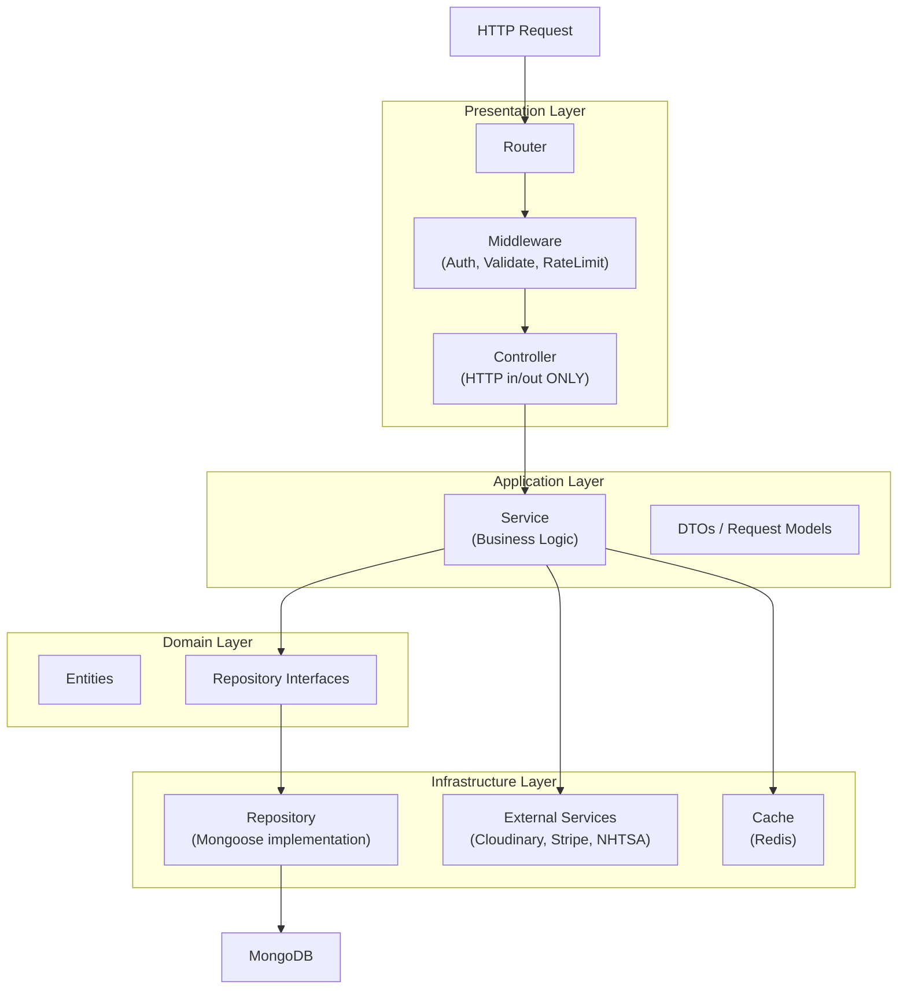

# Báo Cáo Đề Xuất Cải Thiện — Dự Án Carzy

> **Ngày lập:** 16/03/2026 | **Dựa trên:** Clean Architecture + Design Patterns

---

## 1. Tầm Nhìn Kiến Trúc Mục Tiêu

Chuyển dự án từ **MVC phẳng** sang **Layered Architecture** với sự tách biệt rõ ràng:



---

## 2. Design Patterns Được Đề Xuất

### Pattern 1: Repository Pattern (Quan trọng nhất)

**Vấn đề hiện tại:** Controller và Service đều trực tiếp gọi Mongoose model.

**Giải pháp:** Tạo một tầng Repository trừu tượng, tách biệt database logic.

```
api/src/
├── repositories/          ← MỚI
│   ├── base/
│   │   └── BaseRepository.js
│   ├── UserRepository.js
│   └── VehicleRepository.js
├── services/              ← Cải thiện: chỉ gọi Repository
│   ├── UserService.js
│   └── VehicleService.js
└── controllers/           ← Cải thiện: chỉ xử lý HTTP
    ├── UserController.js
    └── VehicleController.js
```

**Ví dụ triển khai:**

```js
// repositories/base/BaseRepository.js
class BaseRepository {
  constructor(model) {
    this.model = model;
  }

  async findById(id, projection = '-password_hash') {
    return this.model.findById(id).select(projection);
  }

  async findOne(filter) {
    return this.model.findOne(filter);
  }

  async create(data) {
    return this.model.create(data);
  }

  async updateById(id, data, options = { new: true, runValidators: true }) {
    return this.model.findByIdAndUpdate(id, data, options);
  }

  async deleteById(id) {
    return this.model.findByIdAndDelete(id);
  }

  async paginate(filter = {}, { page = 1, limit = 10, sort = { created_at: -1 } } = {}) {
    const skip = (page - 1) * limit;
    const [data, total] = await Promise.all([
      this.model.find(filter).sort(sort).skip(skip).limit(limit),
      this.model.countDocuments(filter)
    ]);
    return { data, total, page, limit, pages: Math.ceil(total / limit) };
  }
}

// repositories/UserRepository.js
class UserRepository extends BaseRepository {
  constructor() {
    super(require('../models/User'));
  }

  async findByEmail(email) {
    return this.model.findOne({ email });
  }

  async findWithStats(userId) {
    // Đặt aggregate query ở đây thay vì trong controller
    const [user, vehicleCount, favoriteCount] = await Promise.all([
      this.findById(userId),
      require('../models/Vehicle').countDocuments({ user: userId, status: 'approved' }),
      require('../models/Favorite').countDocuments({ user: userId })
    ]);
    return { ...user.toObject(), vehicle_count: vehicleCount, favorite_count: favoriteCount };
  }
}

module.exports = new UserRepository();
```

---

### Pattern 2: Service Layer Hoàn Chỉnh (SRP)

**Vấn đề hiện tại:** JWT logic nằm trong controller, business logic trải rộng nhiều nơi.

**Giải pháp:** Service chứa toàn bộ business logic, sử dụng Repository.

```js
// services/AuthService.js — Tách JWT ra riêng
const jwt = require('jsonwebtoken');
const userRepository = require('../repositories/UserRepository');

class AuthService {
  generateToken(userId, expiresIn = '30d') {
    return jwt.sign({ id: userId }, process.env.JWT_SECRET, { expiresIn });
  }

  generateRefreshToken(userId) {
    return jwt.sign({ id: userId }, process.env.JWT_REFRESH_SECRET, { expiresIn: '30d' });
  }

  async login(email, password) {
    const user = await userRepository.findByEmail(email);
    if (!user) throw new AuthError('Email hoặc mật khẩu không đúng', 401);
    if (user.is_locked) throw new AuthError('Tài khoản đã bị khóa', 401);

    const isMatch = await user.matchPassword(password);
    if (!isMatch) throw new AuthError('Email hoặc mật khẩu không đúng', 401);

    return { user, token: this.generateToken(user._id) };
  }

  async register(userData) {
    const existing = await userRepository.findByEmail(userData.email);
    if (existing) throw new ConflictError('Email đã được đăng ký');

    const user = await userRepository.create({ ...userData, role: 'user' });
    return { user, token: this.generateToken(user._id) };
  }
}
```

---

### Pattern 3: Custom Error Classes (Chain of Responsibility)

**Vấn đề hiện tại:** Error handling không đồng nhất, mỗi controller tự xử lý.

```js
// utils/errors.js
class AppError extends Error {
  constructor(message, statusCode) {
    super(message);
    this.statusCode = statusCode;
    this.isOperational = true; // Phân biệt lỗi có thể xử lý vs lỗi bug
  }
}

class AuthError extends AppError {
  constructor(message) { super(message, 401); }
}

class ForbiddenError extends AppError {
  constructor(message = 'Không có quyền truy cập') { super(message, 403); }
}

class NotFoundError extends AppError {
  constructor(resource = 'Resource') { super(`${resource} không tồn tại`, 404); }
}

class ConflictError extends AppError {
  constructor(message) { super(message, 409); }
}

// middleware/errorHandler.js — Global error handler cải thiện
const errorHandler = (err, req, res, next) => {
  if (err.isOperational) {
    return res.status(err.statusCode).json({
      status: 'error',
      message: err.message
    });
  }

  // Bug không mong đợi — log và trả về 500
  logger.error('Unexpected error:', err);
  res.status(500).json({
    status: 'error',
    message: process.env.NODE_ENV === 'production'
      ? 'Đã xảy ra lỗi, vui lòng thử lại sau.'
      : err.message
  });
};
```

---

### Pattern 4: Validation Middleware (Strategy Pattern)

**Vấn đề hiện tại:** `express-validator` đã được cài nhưng không được sử dụng.

```js
// middleware/validators/userValidators.js
const { body, validationResult } = require('express-validator');

const validateRequest = (req, res, next) => {
  const errors = validationResult(req);
  if (!errors.isEmpty()) {
    return res.status(422).json({
      status: 'validation_error',
      errors: errors.array().map(e => ({ field: e.path, message: e.msg }))
    });
  }
  next();
};

const registerValidators = [
  body('email').isEmail().withMessage('Email không hợp lệ').normalizeEmail(),
  body('password').isLength({ min: 8 }).withMessage('Mật khẩu cần ít nhất 8 ký tự'),
  body('phone_number').matches(/^[0-9]{10,11}$/).withMessage('Số điện thoại không hợp lệ'),
  body('full_name').notEmpty().trim().withMessage('Họ tên là bắt buộc'),
  validateRequest
];

const vehicleValidators = [
  body('type').isIn(['car', 'motorcycle', 'bicycle', 'truck']).withMessage('Loại xe không hợp lệ'),
  body('price').isNumeric().isFloat({ min: 0 }).withMessage('Giá không hợp lệ'),
  body('year').isInt({ min: 1900, max: new Date().getFullYear() + 1 }),
  validateRequest
];

// Sử dụng trong routes:
// router.post('/register', registerValidators, authController.register);
```

---

### Pattern 5: Logger Service (Facade Pattern)

**Vấn đề hiện tại:** `console.log` rải rác, kể cả log Cloudinary API key length.

```js
// utils/logger.js
const winston = require('winston'); // npm install winston

const logger = winston.createLogger({
  level: process.env.NODE_ENV === 'production' ? 'info' : 'debug',
  format: winston.format.combine(
    winston.format.timestamp(),
    winston.format.json()
  ),
  transports: [
    new winston.transports.Console({
      format: winston.format.simple()
    }),
    // Production: thêm file transport hoặc CloudWatch
  ]
});

module.exports = logger;

// Thay thế tất cả console.log bằng:
// logger.info('Vehicle created', { vehicleId: vehicle._id });
// logger.error('DB error', { error: err.message });
// logger.debug('Auth check', { userId: req.user._id }); // Chỉ hiện ở dev
```

---

### Pattern 6: Controller Gọn (Thin Controller)

**Vấn đề hiện tại:** [userController.js](file:///d:/Carzy/packages/api/src/controllers/userController.js) dài 687 dòng.

**Mục tiêu:** Controller chỉ làm đúng 1 việc — chuyển đổi HTTP request/response.

```js
// controllers/AuthController.js — Sau khi tách
class AuthController {
  constructor(authService) {
    this.authService = authService; // Dependency Injection
  }

  register = async (req, res, next) => {
    try {
      const result = await this.authService.register(req.body);
      res.status(201).json(result);
    } catch (error) {
      next(error); // Đẩy lỗi lên global handler
    }
  };

  login = async (req, res, next) => {
    try {
      const result = await this.authService.login(req.body.email, req.body.password);
      res.json(result);
    } catch (error) {
      next(error);
    }
  };
}
```

---

### Pattern 7: Observer Pattern cho Notifications

**Vấn đề hiện tại:** Notification logic bị gọi hardcode trong vehicleController.

```js
// events/EventEmitter.js
const EventEmitter = require('events');
const eventBus = new EventEmitter();

// events/handlers/vehicleEventHandler.js
const notificationService = require('../services/NotificationService');

eventBus.on('vehicle:approved', async ({ vehicle, userId }) => {
  await notificationService.sendVehicleApprovedNotification(vehicle, userId);
});

eventBus.on('vehicle:rejected', async ({ vehicle, userId, reason }) => {
  await notificationService.sendVehicleRejectedNotification(vehicle, userId, reason);
});

// Trong VehicleService — sử dụng event thay vì gọi trực tiếp:
// eventBus.emit('vehicle:approved', { vehicle, userId: vehicle.user._id });
```

---

## 3. Cải Thiện Frontend

### 3.1 Custom Hooks cho API Calls

**Vấn đề hiện tại:** `fetch()` trực tiếp trong Navbar component.

```ts
// hooks/useVehicleSearch.ts
import { useState, useCallback } from 'react';
import { VehicleService } from '@/services/vehicleService';

export const useVehicleSearch = () => {
  const [results, setResults] = useState<Vehicle[]>([]);
  const [isLoading, setIsLoading] = useState(false);

  const search = useCallback(async (query: string) => {
    if (query.trim().length < 2) {
      setResults([]);
      return;
    }
    setIsLoading(true);
    try {
      const data = await VehicleService.quickSearch(query);
      setResults(data.vehicles || []);
    } finally {
      setIsLoading(false);
    }
  }, []);

  return { results, isLoading, search };
};
```

### 3.2 Tách Component (Single Responsibility)

**Vấn đề hiện tại:** [Navbar.tsx](file:///d:/Carzy/packages/web/src/components/Navbar.tsx) (708 dòng) là "God Component".

```
components/
├── navbar/
│   ├── Navbar.tsx              ← Chỉ layout, ~80 dòng
│   ├── NavSearchBar.tsx        ← Search logic
│   ├── NavUserMenu.tsx         ← User dropdown
│   ├── NavCategoryMenu.tsx     ← Categories
│   └── NavMobileMenu.tsx       ← Mobile navigation
└── icons/
    ├── CarIcon.tsx
    ├── MotorcycleIcon.tsx
    └── BicycleIcon.tsx
```

### 3.3 API Service Layer (Frontend)

```ts
// services/vehicleService.ts — Centralized API client
import { apiClient } from '@/lib/apiClient';

export const VehicleService = {
  quickSearch: (query: string) =>
    apiClient.get(`/vehicles/quick-search?search=${query}&limit=5`),

  getAll: (params: VehicleSearchParams) =>
    apiClient.get('/vehicles', { params }),

  getById: (id: string) =>
    apiClient.get(`/vehicles/${id}`),

  create: (data: CreateVehicleDto) =>
    apiClient.post('/vehicles', data),
};
```

### 3.4 Bảo Mật Token (HttpOnly Cookie)

**Vấn đề hiện tại:** JWT lưu trong `localStorage` — dễ bị XSS.

```ts
// Phía server: gửi token qua httpOnly cookie
res.cookie('token', token, {
  httpOnly: true,    // JavaScript không đọc được
  secure: process.env.NODE_ENV === 'production', // HTTPS only
  sameSite: 'strict',
  maxAge: 30 * 24 * 60 * 60 * 1000 // 30 ngày
});

// Phía client: AuthContext đơn giản hơn, không cần localStorage
const login = async (email, password) => {
  await axios.post('/auth/login', { email, password }, { withCredentials: true });
  // Cookie tự động gửi theo mỗi request
};
```

---

## 4. Cải Thiện Database

### 4.1 Thêm Index cho Vehicle

```js
// models/Vehicle.js — Thêm compound indexes
vehicleSchema.index({ type: 1, status: 1 });
vehicleSchema.index({ make: 1, model: 1 });
vehicleSchema.index({ price: 1 });
vehicleSchema.index({ location: 1 });
vehicleSchema.index({ user: 1, status: 1 });
vehicleSchema.index({ title: 'text', description: 'text', make: 'text', model: 'text' }); // Full-text search
```

### 4.2 Dùng Timestamps của Mongoose

```js
// Thay thế custom created_at/updated_at
const vehicleSchema = new mongoose.Schema({ ... }, {
  timestamps: { createdAt: 'created_at', updatedAt: 'updated_at' }
});
// Bỏ pre-save hook thủ công
```

---

## 5. Roadmap Cải Thiện Theo Ưu Tiên

### 🔴 Giai Đoạn 1 — Quan Trọng (1–2 tuần)

| Việc cần làm | Lý do | Effort |
|---|---|---|
| Xóa toàn bộ `console.log` debug | Bảo mật, cleanup | Thấp |
| Thêm Winston logger | Observability | Thấp |
| Thêm global error handler đầy đủ | Consistency | Thấp |
| Kích hoạt `express-validator` | Data integrity | Trung bình |
| Thêm MongoDB indexes | Performance | Thấp |
| Tách auth routes ra `authRoutes.js` | Code organization | Thấp |

### 🟡 Giai Đoạn 2 — Trung Bình (2–4 tuần)

| Việc cần làm | Lý do | Effort |
|---|---|---|
| Tạo Repository Pattern | Testability | Trung bình |
| Refactor Controller → Service → Repository | SRP | Cao |
| Tách [Navbar.tsx](file:///d:/Carzy/packages/web/src/components/Navbar.tsx) thành 5 components nhỏ | Maintainability | Trung bình |
| Tạo custom hooks cho API calls | Reusability | Trung bình |
| Thêm Custom Error Classes | Consistency | Thấp |
| Observer Pattern cho Notifications | Decoupling | Trung bình |

### 🟢 Giai Đoạn 3 — Dài Hạn (1–2 tháng)

| Việc cần làm | Lý do | Effort |
|---|---|---|
| Chuyển token sang httpOnly Cookie | Security | Cao |
| Viết Unit Tests (Jest) cho Services | Quality | Cao |
| Viết Integration Tests cho API | Quality | Cao |
| Thêm Redis cache cho vehicle listing | Performance | Cao |
| Tạo `packages/shared` cho types dùng chung | DRY | Trung bình |
| API Rate Limiting | Security | Trung bình |

---

## 6. Tóm Tắt Nguyên Tắc Áp Dụng

| Nguyên tắc | Áp dụng vào |
|---|---|
| **SRP** (Single Responsibility) | Tách Controller/Service/Repository; Tách component lớn |
| **OCP** (Open/Closed) | Repository Base class + extension |
| **DIP** (Dependency Inversion) | Inject Repository vào Service thay vì require trực tiếp |
| **Repository Pattern** | Tách Mongoose queries ra khỏi business logic |
| **Observer Pattern** | Notification system không phụ thuộc vào vehicle controller |
| **Strategy Pattern** | Validation middleware pluggable |
| **Facade Pattern** | Logger service đóng gói winston |
| **Factory Pattern** | Error classes factory |

> [!TIP]
> Không cần áp dụng tất cả cùng một lúc. Bắt đầu từ Giai Đoạn 1 (cleanup, validation, error handling) để có hiệu quả ngay lập tức với effort thấp nhất.
